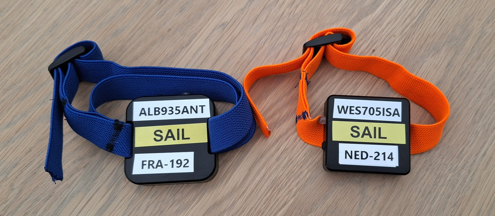

## Prince of Speed - GPS Guidance

Date created: 18 Apr 2025

Last updated: 18 Apr 2025

### GPS Devices

During the ISWC Speed World Championship you will be provided with a Motion Mini, showing the device name and your sail number.

There are two different models of the Motion Mini. The newer ones have a double strap (e.g. FRA-192), which makes them more secure.

You should adjust the strap, ensuring it fits you properly and minimises the risk of it being lost during a crash:

- Adjust the strap so that it is relatively tight above your bicep, and will not easily come off in a crash
- Once adjusted for size, thread the remainder of the strap back through the buckle, as shown in the photo
- Please do not cut the elastic, or tie knots in it. Threading it back through the buckle will prevent it from slipping

When wearing the device on the water, please adhere to the following guidance:

- Wear the Motion above your right bicep, or if winging on the same arm as your wing leash
- Ensure the labelled side is facing directly upwards when sailing, so the antenna has a clear view of the sky
- Ensure the Motion is NOT being worn underneath neoprene or lycra

The Motion should already have been switched on when you collect it, and the red light will flash once every 10-12 seconds.

### Backup Devices

Everyone is advised to wear a suitable GPS device as a backup. Several types of GPS are suitable:

- Motion LCD or Motion Mini
- ESP or LISA
- Locosys GT-31, GW-52 or GW-60
- COROS VERTIX 2, VERTIX 2S, APEX 2, APEX 2 Pro
- Garmin watch approved by GPS-Speedsurfing and using APPro Windsurf

Please ensure your backup device is configured correctly.

### Device Configuration

#### Motion GPS

Please ensure that your Motion LCD / Motion Mini is recording at 5 Hz or 10 Hz.

Whilst sailing be sure to wear your Motion above your bicep, facing upwards so that it has a clear view of the sky.

When sharing your data with the timekeeper, please send the OAO file (not GPX).

#### ESP or LISA

Please ensure that your ESP or LISA device is recording at 5 Hz or 10 Hz.

Whilst sailing be sure to wear your device above your bicep, facing upwards so that it has a clear view of the sky.

When sharing your data with the timekeeper, please send the UBX or GPY file (not GPX).

#### Locosys

Instructions specific to each Locosys device are provided below:

GW-60 watch:

- Please ensure the GW-60 is recording at 5 Hz
- Please wear the GW-60 so that it is facing upwards, and do NOT wear it on the arm using underhand grip
- Please clear the log prior to the start of each session

GW-52:

- Please ensure it is recording at 5 Hz
- Please wear the GW-52 in an Aquapac above your bicep, facing upwards so that it has a clear view of the sky
- Please clear the log prior to the start of each session

GT-31:

- Please wear the GT-31 in an Aquapac above your bicep, facing upwards so that it has a clear view of the sky
- Please clear the log prior to the start of each session

When sharing your data with the timekeeper, please send the SBN or SBP file (not GPX).

#### COROS

The APEX 2, APEX 2 Pro, VERTIX 2 and VERTIX 2S are all suitable as backups.

Please wear your COROS watch so that it is facing upwards, and do NOT wear it on the arm using underhand grip.

Firmware issues have plagued COROS since May 2024 so it is very important that you check your firmware.

All of the different firmware versions and their suitability can be found on another page by using this [link](https://logiqx.github.io/gps-details/devices/coros/firmware/).

Important for COROS users:

- Firmware version
  - Check the suitability of your firmware and downgrade if necessary
- Satellite settings
  - Do NOT use standard GPS
  - Use "All Systems" or "Dual Frequency" on the newer COROS watches
  - Use "GPS, BeiDou, Galileo, QZSS" on the older COROS watches
- Activity mode
  - Do NOT use the "Windsurfing" mode because it is not using Doppler speeds
  - Use the "Speedsurfing" mode for the best quality results and reporting of your 500 meters runs

Full details about COROS watch setup can be found on another page by using this [link](https://logiqx.github.io/gps-guides/guidance/coros/setup/).

When sharing your data with the timekeeper, please send the FIT file (not GPX).

If you do not know how to get the FIT file from your COROS then please use this [link](https://logiqx.github.io/gps-guides/guidance/coros/analysis/).

#### Garmin

The Garmin watches that incorporate a multi-band Airoha or Synaptics chipset are all suitable.

This includes watches such as the fēnix 7 and fēnix 8, but excludes earlier models such as the fēnix 5 and fēnix 6.

Please wear your Garmin watch so that it is facing upwards, and do NOT wear it on the arm using underhand grip.

The full list of suitable Garmin watches can be found on another page by using this [link](https://logiqx.github.io/gps-details/devices/garmin/watches/).

Important for Garmin users:

- Data recording
  - Set to "every second", rather than the Garmin default which is called “smart” recording
- Satellite Settings
  - Do NOT use standard GPS
  - Use "All Systems" or "All Systems + Multi-Band" for the best quality results
- Suitable App
  - Please use [APPro Windsurf](https://apps.garmin.com/apps/9567700b-6587-44be-9708-879bfc844791) for the best quality results and reporting of your 500 meters runs

Full details about Garmin watch setup can be found on another page by using this [link](https://logiqx.github.io/gps-guides/guidance/garmin/setup/).

When sharing your data with the timekeeper, please send the FIT file (not GPX).

If you do not know how to get the FIT file from your Garmin then please use this [link](https://logiqx.github.io/gps-guides/guidance/garmin/analysis/).

